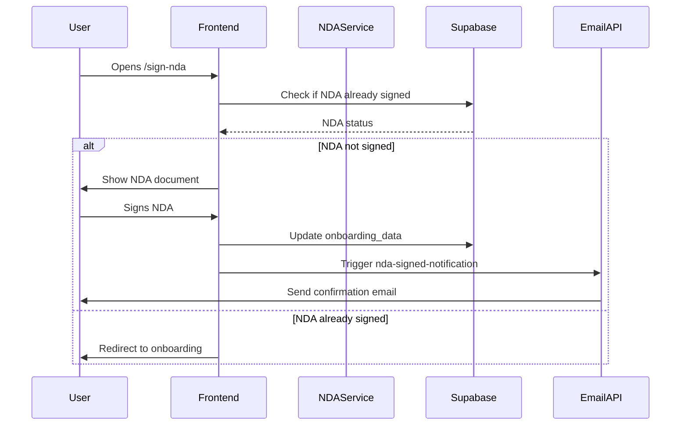
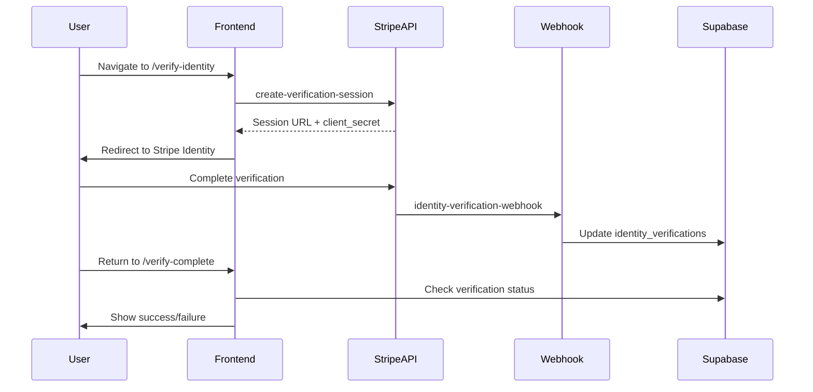
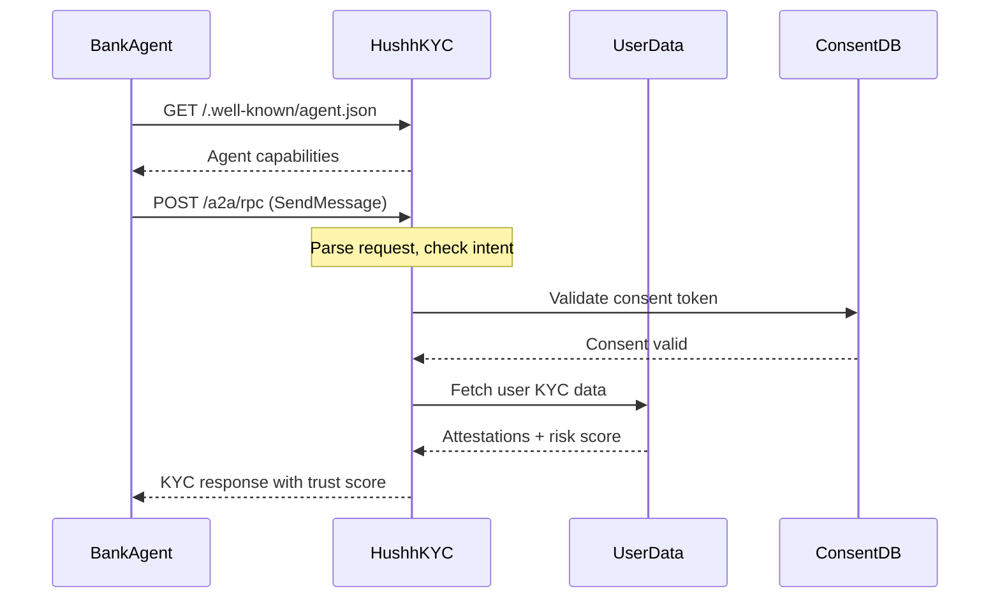

# 🏗️ Hushh KYC & Onboarding Architecture

> Complete documentation of the KYC (Know Your Customer) and Onboarding flow from NDA signing to investor profile completion.

## 📋 Table of Contents

- [Overview](#overview)
- [User Journey](#user-journey)
- [Frontend Components](#frontend-components)
- [Backend Edge Functions](#backend-edge-functions)
- [Database Schema](#database-schema)
- [API Endpoints](#api-endpoints)
- [Integration Flow](#integration-flow)

---

## Overview

The Hushh KYC & Onboarding system is a comprehensive investor verification and profile creation pipeline that includes:

- **NDA Signing** - Legal agreement before access
- **15-Step Onboarding** - Progressive data collection
- **Identity Verification** - Stripe Identity integration
- **KYC Agent Network** - A2A protocol for cross-institutional verification
- **CEO Calendar Booking** - Optional high-value investor meetings

---

## User Journey

```
┌─────────────────────────────────────────────────────────────────┐
│                      USER STARTS ONBOARDING                      │
└───────────────────────────────┬─────────────────────────────────┘
                                │
                                ▼
┌─────────────────────────────────────────────────────────────────┐
│  STEP 1: NDA SIGNING                                             │
│  ├── Frontend: /sign-nda                                         │
│  ├── Service: ndaService.ts                                      │
│  ├── Backend: nda-signed-notification (sends email)             │
│  └── DB: onboarding_data.nda_signed_at                          │
└───────────────────────────────┬─────────────────────────────────┘
                                │
                                ▼
┌─────────────────────────────────────────────────────────────────┐
│  STEPS 1-15: ONBOARDING DATA COLLECTION                          │
│  ├── Frontend: /onboarding/step-{1-15}                          │
│  ├── AI Services:                                                │
│  │   ├── hushh-location-geocode (GPS detection)                 │
│  │   ├── hushh-address-inference (address AI)                   │
│  │   └── hushh-profile-search (profile enrichment)              │
│  └── DB: onboarding_data table                                   │
└───────────────────────────────┬─────────────────────────────────┘
                                │
                                ▼
┌─────────────────────────────────────────────────────────────────┐
│  IDENTITY VERIFICATION (Stripe)                                  │
│  ├── Frontend: /onboarding/verify-identity                      │
│  ├── Backend: create-verification-session                       │
│  ├── Webhook: identity-verification-webhook                     │
│  └── DB: identity_verifications table                           │
└───────────────────────────────┬─────────────────────────────────┘
                                │
                                ▼
┌─────────────────────────────────────────────────────────────────┐
│  KYC ATTESTATION (A2A Protocol)                                  │
│  ├── Frontend: KYC components (KycAgentsCollabScreen, etc.)     │
│  ├── Backend:                                                    │
│  │   ├── kyc-agent-a2a (basic)                                  │
│  │   ├── kyc-agent-a2a-protocol (advanced)                      │
│  │   └── kyc-agent-agentic (AI negotiation)                     │
│  └── DB: kyc_attestations, kyc_requests                         │
└───────────────────────────────┬─────────────────────────────────┘
                                │
                                ▼
┌─────────────────────────────────────────────────────────────────┐
│  CEO MEETING (Optional)                                          │
│  ├── Frontend: /onboarding/meet-ceo                             │
│  ├── Payment: onboarding-create-checkout                        │
│  └── Calendar: ceo-calendar-booking                             │
└───────────────────────────────┬─────────────────────────────────┘
                                │
                                ▼
┌─────────────────────────────────────────────────────────────────┐
│  COMPLETED: INVESTOR PROFILE                                     │
│  ├── DB: investor_profiles table                                │
│  └── Profile: /investor/{slug}                                  │
└─────────────────────────────────────────────────────────────────┘
```

---

## Frontend Components

### 📁 NDA Signing

| File | Purpose |
|------|---------|
| `src/pages/sign-nda/index.tsx` | NDA signing page |
| `src/services/nda/ndaService.ts` | NDA service functions |
| `src/components/GlobalNDAGate.tsx` | Global NDA enforcement |

### 📁 Onboarding Steps

```
src/pages/onboarding/
├── Step1.tsx   → Welcome/Start
├── Step2.tsx   → Account Type Selection
├── Step3.tsx   → Legal Name
├── Step4.tsx   → Email/Phone
├── Step5.tsx   → Date of Birth
├── Step6.tsx   → Residence Country (GPS Detection)
├── Step7.tsx   → Citizenship
├── Step8.tsx   → SSN/Tax ID
├── Step9.tsx   → Employment Status
├── Step10.tsx  → Address (City/State/Country dropdowns)
├── Step11.tsx  → Investment Experience
├── Step12.tsx  → Accreditation Status
├── Step13.tsx  → Investment Amount
├── Step14.tsx  → Bank Account Details
├── Step15.tsx  → Review & Submit
├── VerifyIdentity.tsx  → Stripe Identity Verification
├── VerifyComplete.tsx  → Verification Complete
├── MeetCeo.tsx         → CEO Calendar Booking
└── InvestorGuide.tsx   → Guide/Documentation
```

### 📁 KYC Components (Agent-to-Agent UI)

```
src/components/kyc/
├── screens/
│   ├── KycIntroScreen.tsx           → Introduction screen
│   ├── KycDetailsConsentScreen.tsx  → Consent collection
│   ├── KycAgentsCollabScreen.tsx    → Agent collaboration view
│   ├── KycResultPassScreen.tsx      → Success result
│   ├── KycResultReviewScreen.tsx    → Manual review needed
│   ├── KycResultFullKycScreen.tsx   → Full KYC required
│   └── KycAgentDetailModal.tsx      → Agent details modal
├── AgentCollabStrip.tsx             → Agent collaboration strip
├── AgentConversationLog.tsx         → A2A conversation log
├── KYCResultCard.tsx                → Result display card
└── index.ts                         → Exports
```

### 📁 A2A Playground Components

```
src/components/a2aPlayground/
├── A2AScenarioSetupScreen.tsx       → Scenario configuration
├── A2AConversationScreen.tsx        → Live conversation view
├── A2AResultSummaryScreen.tsx       → Final results
├── AgentThoughtLog.tsx              → Agent reasoning log
├── TrustGauge.tsx                   → Trust score visualization
├── DataVaultCard.tsx                → Data sharing card
├── MissionControlLayout.tsx         → Mission control layout
├── conversationGenerator.ts         → Mock conversation generator
└── index.ts                         → Exports
```

---

## Backend Edge Functions

### 📦 NDA Functions

| Function | Location | Purpose |
|----------|----------|---------|
| `nda-signed-notification` | `supabase/functions/nda-signed-notification/` | Sends email when NDA is signed |
| `nda-admin-fetch` | `supabase/functions/nda-admin-fetch/` | Admin endpoint to fetch all signed NDAs |

### 📦 Onboarding Functions

| Function | Location | Purpose |
|----------|----------|---------|
| `onboarding-create-checkout` | `supabase/functions/onboarding-create-checkout/` | Stripe payment for onboarding |
| `onboarding-verify-payment` | `supabase/functions/onboarding-verify-payment/` | Verify payment status |
| `hushh-location-geocode` | `supabase/functions/hushh-location-geocode/` | GPS → Address conversion |
| `hushh-address-inference` | `supabase/functions/hushh-address-inference/` | AI-powered address detection |
| `hushh-dob-inference` | `supabase/functions/hushh-dob-inference/` | AI-powered DOB inference |
| `hushh-profile-search` | `supabase/functions/hushh-profile-search/` | Profile enrichment/OSINT |
| `shadow-investigator` | `supabase/functions/shadow-investigator/` | Deep profile analysis |
| `ceo-calendar-booking` | `supabase/functions/ceo-calendar-booking/` | Google Calendar integration |

### 📦 Identity Verification (Stripe)

| Function | Location | Purpose |
|----------|----------|---------|
| `create-verification-session` | `supabase/functions/create-verification-session/` | Creates Stripe Identity session |
| `identity-verification-webhook` | `supabase/functions/identity-verification-webhook/` | Handles Stripe verification webhooks |

### 📦 KYC Agent Functions (A2A Protocol)

| Function | Location | Purpose |
|----------|----------|---------|
| `kyc-agent-a2a` | `supabase/functions/kyc-agent-a2a/` | Basic Agent-to-Agent KYC |
| `kyc-agent-a2a-protocol` | `supabase/functions/kyc-agent-a2a-protocol/` | Advanced A2A with trust scoring |
| `kyc-agent-agentic` | `supabase/functions/kyc-agent-agentic/` | Agentic negotiation patterns |

---

## Database Schema

### Core Tables

```sql
-- Main onboarding data collection
CREATE TABLE onboarding_data (
  id UUID PRIMARY KEY DEFAULT gen_random_uuid(),
  user_id UUID REFERENCES auth.users(id) ON DELETE CASCADE,
  
  -- NDA fields
  nda_signed_at TIMESTAMPTZ,
  nda_version TEXT,
  nda_signer_ip TEXT,
  nda_signer_name TEXT,
  nda_pdf_url TEXT,
  
  -- Personal info
  legal_first_name TEXT,
  legal_last_name TEXT,
  date_of_birth DATE,
  
  -- Contact
  phone_number TEXT,
  phone_dial_code TEXT,
  
  -- Location
  residence_country TEXT,
  citizenship_country TEXT,
  address_line_1 TEXT,
  address_line_2 TEXT,
  address_country TEXT,
  state TEXT,
  city TEXT,
  zip_code TEXT,
  
  -- GPS detection
  gps_location_data JSONB,
  gps_detected_country TEXT,
  gps_detected_state TEXT,
  gps_detected_city TEXT,
  
  -- Employment & Investment
  employment_status TEXT,
  investment_experience TEXT,
  accreditation_status TEXT,
  investment_amount DECIMAL,
  
  -- Banking
  bank_name TEXT,
  account_number_encrypted TEXT,
  routing_number_encrypted TEXT,
  ssn_encrypted TEXT,
  
  -- Progress tracking
  current_step INTEGER DEFAULT 1,
  is_completed BOOLEAN DEFAULT FALSE,
  
  created_at TIMESTAMPTZ DEFAULT NOW(),
  updated_at TIMESTAMPTZ DEFAULT NOW()
);

-- Identity verification results
CREATE TABLE identity_verifications (
  id UUID PRIMARY KEY DEFAULT gen_random_uuid(),
  user_id UUID REFERENCES auth.users(id) ON DELETE CASCADE,
  stripe_session_id TEXT UNIQUE,
  stripe_verification_flow_id TEXT,
  stripe_status TEXT,
  document_verified BOOLEAN DEFAULT FALSE,
  selfie_verified BOOLEAN DEFAULT FALSE,
  provided_email TEXT,
  stripe_response JSONB,
  created_at TIMESTAMPTZ DEFAULT NOW(),
  updated_at TIMESTAMPTZ DEFAULT NOW()
);

-- Investor profiles (final output)
CREATE TABLE investor_profiles (
  id UUID PRIMARY KEY DEFAULT gen_random_uuid(),
  user_id UUID REFERENCES auth.users(id) ON DELETE CASCADE,
  slug TEXT UNIQUE,
  is_public BOOLEAN DEFAULT FALSE,
  profile_data JSONB,
  investment_preferences JSONB,
  privacy_settings JSONB,
  created_at TIMESTAMPTZ DEFAULT NOW(),
  updated_at TIMESTAMPTZ DEFAULT NOW()
);
```

### KYC Tables

```sql
-- KYC attestations from trusted providers
CREATE TABLE kyc_attestations (
  id UUID PRIMARY KEY DEFAULT gen_random_uuid(),
  user_id UUID REFERENCES auth.users(id) ON DELETE CASCADE,
  provider_id TEXT NOT NULL,
  provider_name TEXT NOT NULL,
  verification_level TEXT CHECK (verification_level IN ('basic', 'standard', 'enhanced', 'premium')),
  verified_attributes TEXT[],
  risk_band TEXT CHECK (risk_band IN ('LOW', 'MEDIUM', 'HIGH')),
  attestation_date TIMESTAMPTZ DEFAULT NOW(),
  expiry_date TIMESTAMPTZ,
  raw_response JSONB,
  created_at TIMESTAMPTZ DEFAULT NOW()
);

-- KYC verification requests
CREATE TABLE kyc_requests (
  id UUID PRIMARY KEY DEFAULT gen_random_uuid(),
  user_id UUID REFERENCES auth.users(id) ON DELETE CASCADE,
  requesting_bank_id TEXT NOT NULL,
  status TEXT DEFAULT 'pending',
  consent_token TEXT,
  requested_fields TEXT[],
  result JSONB,
  created_at TIMESTAMPTZ DEFAULT NOW(),
  completed_at TIMESTAMPTZ
);

-- KYC check audit logs
CREATE TABLE kyc_check_logs (
  id UUID PRIMARY KEY DEFAULT gen_random_uuid(),
  requesting_bank_id TEXT NOT NULL,
  user_id UUID,
  consent_token TEXT,
  kyc_status TEXT,
  risk_band TEXT,
  response_time_ms INTEGER,
  created_at TIMESTAMPTZ DEFAULT NOW()
);

-- Institution KYC policies
CREATE TABLE kyc_policies (
  id UUID PRIMARY KEY DEFAULT gen_random_uuid(),
  bank_id TEXT UNIQUE NOT NULL,
  bank_name TEXT NOT NULL,
  bank_country TEXT,
  bank_type TEXT,
  required_attributes TEXT[],
  max_kyc_age_days INTEGER DEFAULT 365,
  min_verification_level TEXT DEFAULT 'standard',
  min_risk_band TEXT DEFAULT 'MEDIUM',
  is_active BOOLEAN DEFAULT TRUE,
  created_at TIMESTAMPTZ DEFAULT NOW()
);

-- User consent tokens for KYC sharing
CREATE TABLE kyc_consent_tokens (
  id UUID PRIMARY KEY DEFAULT gen_random_uuid(),
  user_id UUID REFERENCES auth.users(id) ON DELETE CASCADE,
  token TEXT UNIQUE NOT NULL,
  granted_to_bank_id TEXT NOT NULL,
  scope TEXT[] DEFAULT ARRAY['kyc_status', 'risk_band'],
  expires_at TIMESTAMPTZ NOT NULL,
  used_at TIMESTAMPTZ,
  created_at TIMESTAMPTZ DEFAULT NOW()
);
```

---

## API Endpoints

### NDA Endpoints

| Method | Endpoint | Purpose |
|--------|----------|---------|
| POST | `/functions/v1/nda-signed-notification` | Send NDA signed email notification |
| GET | `/functions/v1/nda-admin-fetch` | Admin: Fetch all signed NDAs |

### Onboarding Endpoints

| Method | Endpoint | Purpose |
|--------|----------|---------|
| POST | `/functions/v1/onboarding-create-checkout` | Create Stripe checkout session |
| POST | `/functions/v1/onboarding-verify-payment` | Verify payment completion |
| POST | `/functions/v1/hushh-location-geocode` | Convert GPS coordinates to address |
| POST | `/functions/v1/hushh-address-inference` | AI-infer address from name/email |
| POST | `/functions/v1/hushh-dob-inference` | AI-infer date of birth |
| POST | `/functions/v1/hushh-profile-search` | Profile enrichment via OSINT |
| POST | `/functions/v1/shadow-investigator` | Deep profile investigation |
| POST | `/functions/v1/ceo-calendar-booking` | Book CEO meeting slot |

### Identity Verification Endpoints

| Method | Endpoint | Purpose |
|--------|----------|---------|
| POST | `/functions/v1/create-verification-session` | Create Stripe Identity session |
| POST | `/functions/v1/identity-verification-webhook` | Handle Stripe webhooks |

### KYC Agent Endpoints (A2A Protocol)

| Method | Endpoint | Purpose |
|--------|----------|---------|
| GET | `/functions/v1/kyc-agent-a2a/.well-known/agent.json` | Agent discovery (A2A spec) |
| POST | `/functions/v1/kyc-agent-a2a/a2a/rpc` | A2A RPC endpoint |
| POST | `/functions/v1/kyc-agent-a2a-protocol` | Advanced A2A with trust scoring |
| POST | `/functions/v1/kyc-agent-agentic` | Agentic negotiation |

---

## Integration Flow

### 1. NDA Flow



### 2. Identity Verification Flow



### 3. KYC A2A Flow



---

## Related Documentation

- [A2A Protocol Implementation](./A2A_PROTOCOL_IMPLEMENTATION.md)
- [Agentic Negotiation Flow](./AGENTIC_NEGOTIATION_FLOW.md)
- [Mobile UI Design Guidelines](./MOBILE_UI_DESIGN_GUIDELINES.md)
- [KYC Agent Product One-Pager](./HUSHH_KYC_AGENT_PRODUCT_ONEPAGER.md)

---

## Environment Variables

```bash
# Supabase
VITE_SUPABASE_URL=your_supabase_url
VITE_SUPABASE_ANON_KEY=your_anon_key
SUPABASE_SERVICE_ROLE_KEY=your_service_role_key

# Stripe
STRIPE_SECRET_KEY=your_stripe_secret
STRIPE_VERIFICATION_FLOW_ID=vf_xxxxx
STRIPE_WEBHOOK_SECRET=whsec_xxxxx

# Google (Calendar)
GOOGLE_SERVICE_ACCOUNT_EMAIL=your_service_account
GOOGLE_PRIVATE_KEY=your_private_key

# AI Services
OPENAI_API_KEY=your_openai_key
VERTEX_AI_ACCESS_TOKEN=your_vertex_token
```

---

## Testing

```bash
# Run all tests
npm run test

# Run specific test suites
npm run test -- tests/nda.test.ts
npm run test -- tests/ndaIntegration.test.ts
npm run test -- tests/step6LocationFlow.test.ts
```

---

*Last updated: January 31, 2026*
